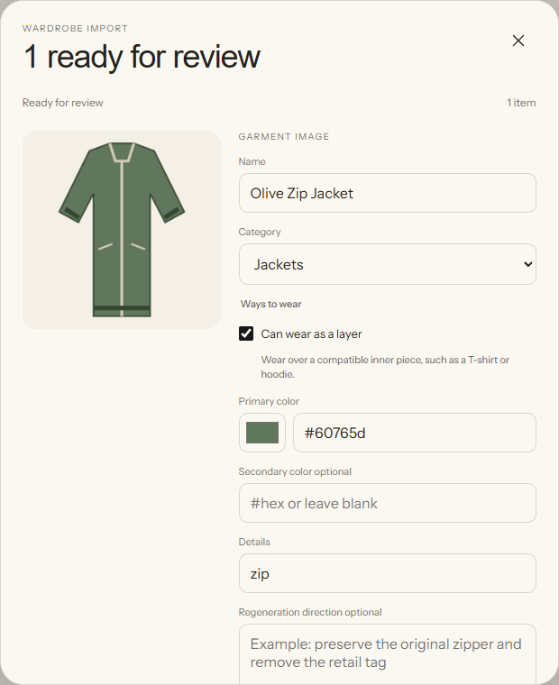
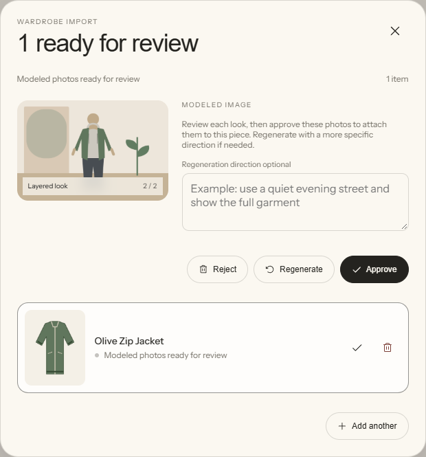
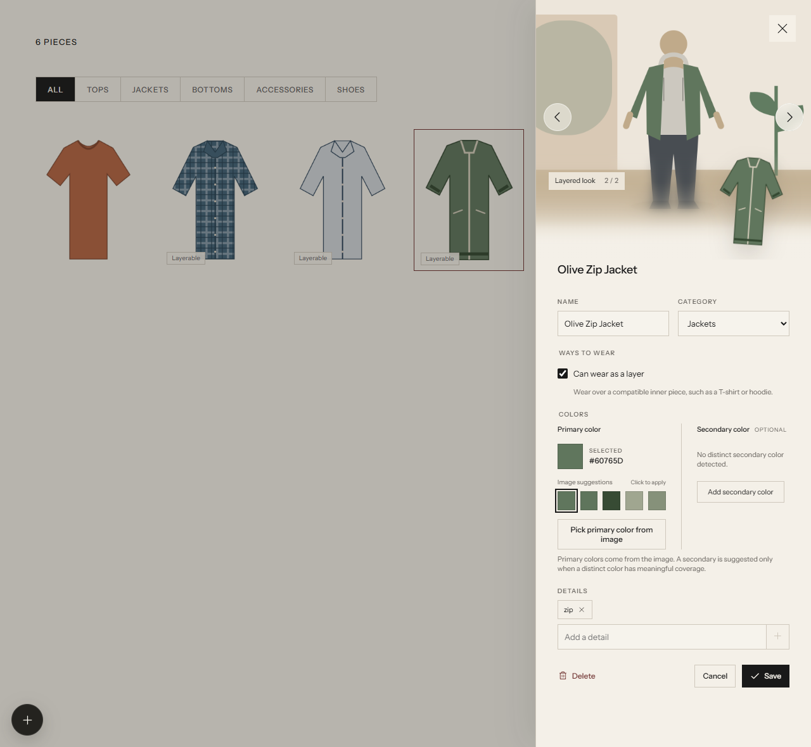
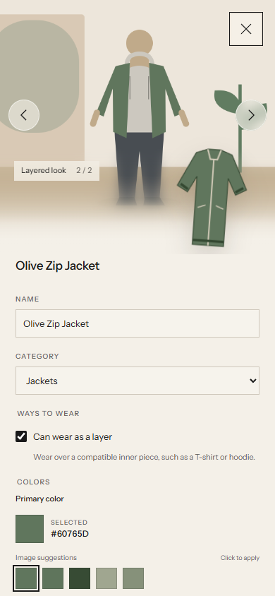

# Browser E2E verification

The complete import and editing flow was exercised in the real web UI with a deterministic local provider and anonymous, code-generated garment and model fixtures. This verifies the application pipeline, persistence, request counts, review rules, and navigation. Live AI classification, generated-photo fidelity, and physical-device behavior were not tested by this run.

## Reproduce

```bash
npm install
npm test
npm run check
npm run e2e:serve
```

Open the printed URL, `http://127.0.0.1:5175/`, in a fresh browser context. The launcher prints four temporary input file paths and serves them at `/__e2e/inputs/olive-zip-jacket.png`, `/__e2e/inputs/blue-flannel-shirt.png`, `/__e2e/inputs/rust-cotton-tee.png`, and `/__e2e/inputs/formal-dress-shirt.png`. It starts with two synthetic trousers. All imports and identity references use an isolated temporary folder; the launcher does not load `.env`, use a real API key, or modify `data/`. Stop with Ctrl+C to close both servers and delete that folder. The port is strict: startup fails if 5175 is occupied.

1. Upload the olive zip jacket through **Add clothes**, approve its crop and garment, then review both modeled images. It stays in **Jackets** and has one prefilled **Can wear as a layer** checkbox. **Approve** must remain disabled until both photos load and are viewed.
2. Open the saved jacket. Hover over the cover, use the next arrow, then focus the carousel and press ArrowLeft. Turn **Can wear as a layer** off, save, reload, and verify the choice and both accepted photos remain. Turn it back on and save; the pair returns without another provider request.
3. Import the flannel, tee, and formal dress shirt through the same approval flow. The flannel gets two photos; the tee and dress shirt start with one. Each remains in **Tops** and has one general layer checkbox.
4. For the dress shirt, enable **Can wear as a layer**, save, and choose **Create layer look**. Review and approve the additional look. The item ID and accepted standard-photo URL must remain unchanged.
5. Repeat gallery navigation at a 390 × 844 viewport with coarse-pointer emulation. Check the arrows, title position, touch targets, and horizontal overflow.

Inspect `/__e2e` for fixture provider requests and the persisted library. This is a manual browser test harness, not an automated browser test runner.

## Observed results

| Flow | Result |
| --- | --- |
| General layer controls | One editable layer checkbox in import and gallery; no shirt checkbox or classification field in the provider schema or persisted records; original five categories retained |
| Jacket and flannel imports | Crop → garment → two reviewed modeled photos each; one wardrobe item per garment; original Jackets/Tops categories retained |
| Approval gate | Disabled after the first photo; enabled after the second was viewed |
| Carousel | Arrows changed from opacity 0 to 1 on hover, with a 60% opaque background; next-arrow and ArrowLeft navigation passed |
| Manual override | Layer suitability stayed off after save/reload; source became `manual`; existing photos were retained |
| Tee and dress-shirt imports | Layer suitability off; one standard photo each |
| Layer styling direction | Layer requests include experienced menswear judgment, fit/proportion/color/texture/occasion, and suitable T-shirt or hoodie inner layers; the jacket fixture illustrates a hoodie |
| Add missing layer look | Exactly one new modeled request; accepted-photo URL reused; same item ID; two approved photos; no extra inventory item |
| Provider totals | 4 classification requests, 4 garment requests, 7 modeled requests |
| Final inventory | 6 items: two seeded trousers, three imported tops, and one imported jacket |
| Trouser sizing | Visible heights were both 189.395 px for the same-size fixtures |
| Titles and touch layout | Titles stayed below garment photos on desktop and narrow screens; 390 px page width had no horizontal overflow; 44 × 44 px arrow targets stayed within the viewport; touch next-arrow navigation passed |

## Screenshots

All 18 integration tests and the production build pass. The browser checks caught and corrected a stale creation-action guard; the missing-layer flow was then retested through approval and persistence.



The jacket's provider-supplied layer suitability is prefilled during import review while its category remains Jackets.



Both standard and layered modeled views are available before the pair is approved.



The saved item carousel displays the layered look over a hoodie and retains one wardrobe item.



The carousel remains usable in a 390 × 844 coarse-pointer browser viewport. This screenshot is browser emulation, not a physical-phone test.
