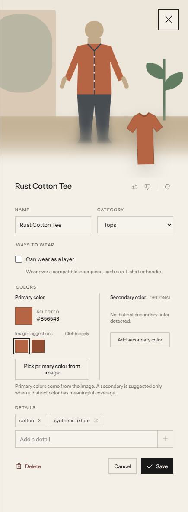
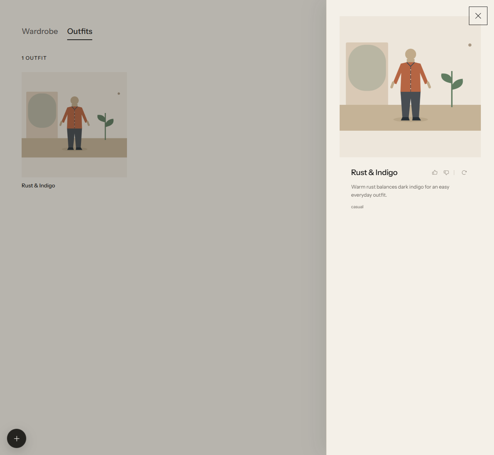
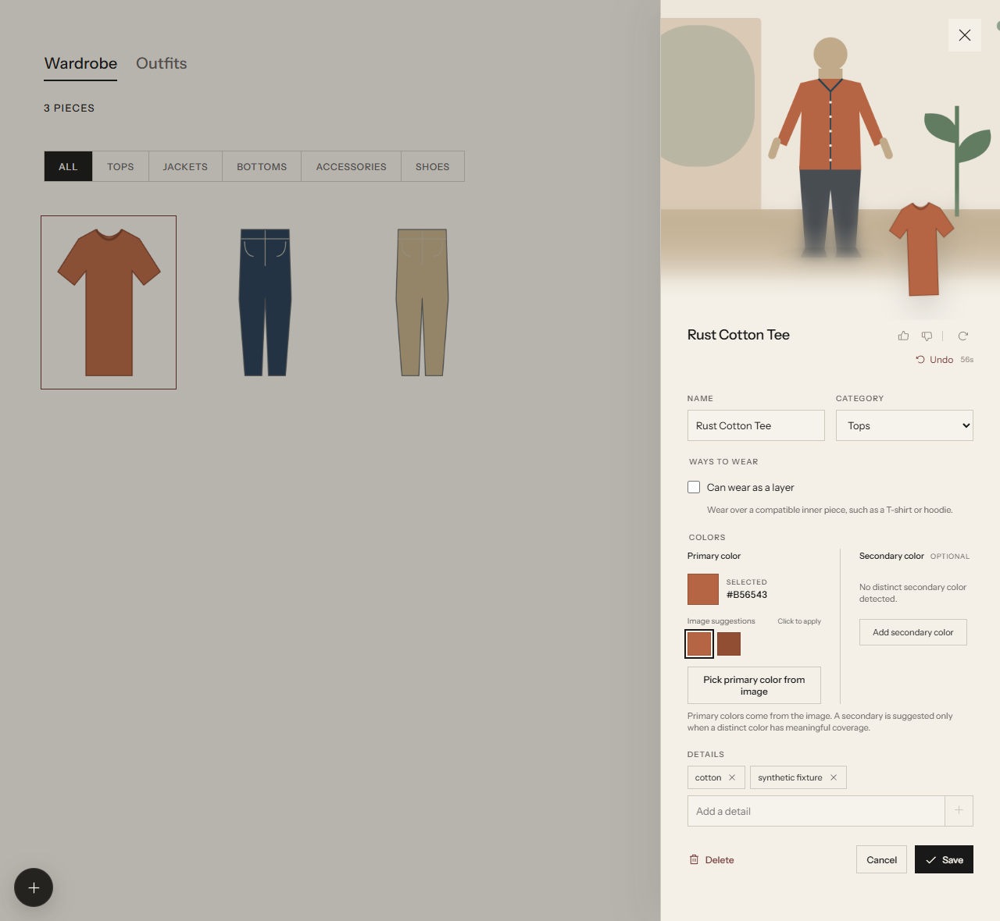
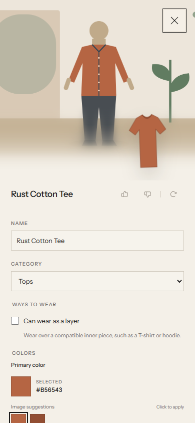
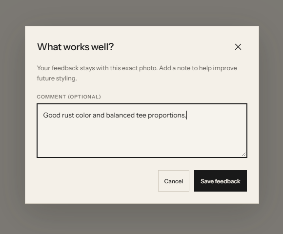
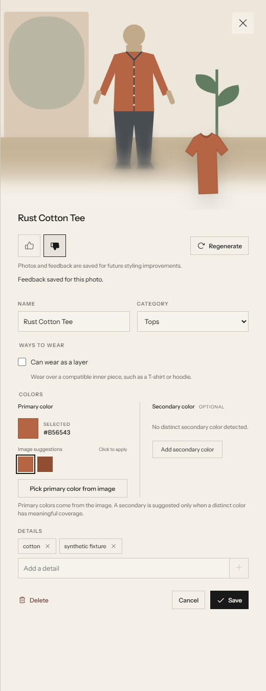
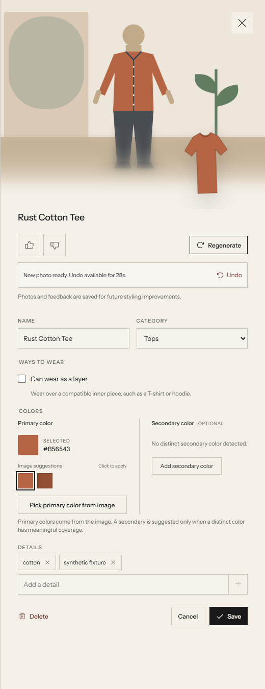
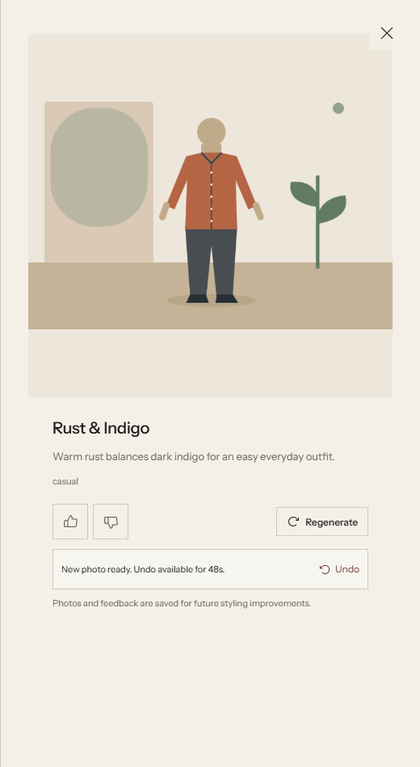
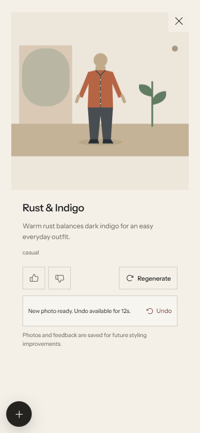
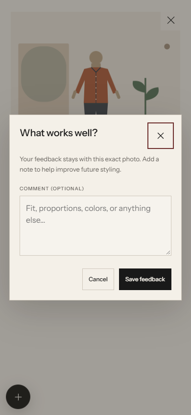

# Photo feedback and regeneration verification

Verified on October 8, 2026 with the real React interface, local import/photo middleware, persisted history files, and an isolated deterministic provider at `http://127.0.0.1:5175/`.

The fixture contains three anonymous garments and one complete outfit. Its images are drawn fixtures, not AI photographs. This run verifies the application flow and saved records; it does not establish live AI image quality, provider reliability, or physical-device behavior. The personal wardrobe and the real provider were not used.

## Reproduce

Run `npm run e2e:serve`, open the reported local URL in a fresh browser, and use the Rust Cotton Tee and Rust & Indigo fixtures. The fixture creates temporary data and provides read-only observations at `/__e2e`. Stop the fixture server when finished. These checks were performed through browser controls, not through direct mutation of the API or fixture data.

## Observed results

All 32 automated tests and the production build pass. Integration checks additionally cover stale generation results, failed follow-up Undo preservation, deleted garments, invalid returned images and configured wardrobe directories.

| Check | Result |
| --- | --- |
| Preview feedback | Thumbs up opens a comment popup. Saving persists the rating and comment on the exact image version. Cancelling a thumbs-down popup leaves the saved feedback unchanged. |
| Negative feedback | A regenerated preview accepts its own thumbs-down comment; the original keeps its positive comment. The negative rating remains selected after a real page reload. |
| Regeneration | Optional direction is preserved in the generated prompt. The prior image remains visible during generation, and regeneration controls disable while pending. Double submission results in one provider request. |
| Undo | The server grants exactly 60,000 ms from generation completion. A preview's Undo remains available after a real page reload and restores the preceding image. Complete-outfit Undo restores the original and its saved rating. |
| Actual expiration | After the real one-minute window elapses, Undo disappears while the previous and new images remain retained. |
| Complete outfits | The Outfits collection and detail viewer expose the same feedback and regeneration controls. A regenerated outfit requests square `1024x1024` output and references the face, body, tee, and jeans. |
| Version separation | New image versions have no inherited rating. Feedback changes and regeneration/Undo actions remain recorded as history events. |
| Retention | Three preview versions and three outfit versions remain in history after two regenerations of each. All six image URLs return HTTP 200, including versions reverted with Undo. |
| Touch layout | At an emulated `390x844` mobile touch viewport, page width and scroll width are both 390 px. Rating, regeneration, Undo, popup close, and popup action controls are at least 44 px high. The popup fits within the viewport. |
| Browser errors | No browser console errors on the final reloaded page. |

The isolated provider recorded four generation requests: two preview requests and two complete-outfit requests. No garment extraction or classification requests occurred in this run.

The touch check found that the shared button style reduced Regenerate to 36 px. The photo-action selectors now preserve 44 px controls, and the corrected sizes were measured again in the browser.

## Screenshots

### Compact title-row update

Option 1 is the implemented design for both modeled previews and complete outfits. The three borderless icons are 15 px and sit beside the title. Desktop click areas measure 28 × 30 px; touch areas remain 44 × 44 px with the same small visible glyphs. Permanent explanatory copy and the separate action row are removed. Undo appears temporarily as an unboxed link and countdown; screen-reader status messages remain available without announcing every countdown tick.

The updated real UI was checked with the isolated provider: feedback and comments persisted, regeneration completed, Undo restored the preceding version with all three test versions retained, and outfit controls shared the title row. The 390 px touch viewport had no horizontal overflow or console errors. All 38 tests and the production build passed.

### Original feature verification

Screenshots were inspected. Desktop captures are cropped to the relevant popup or side panel for readability; mobile captures show the full 390 px viewport. All displayed content is anonymous fixture content.

